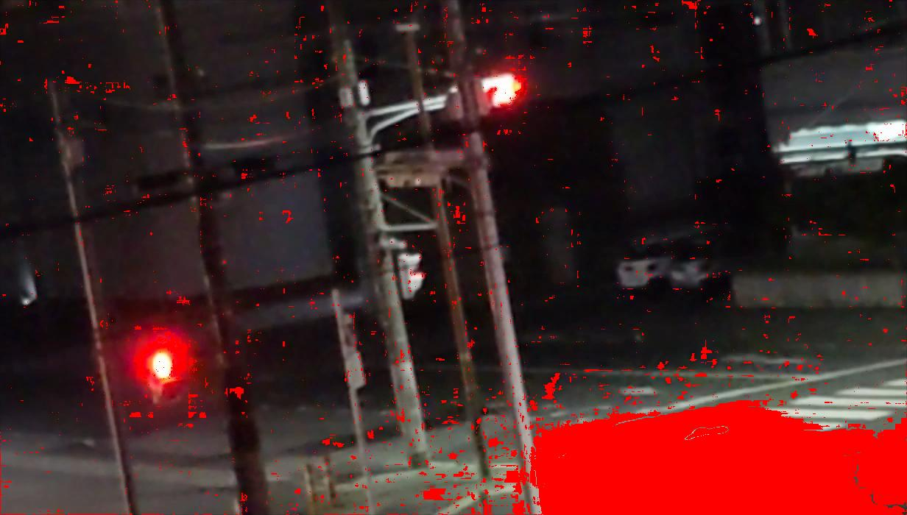

# image-processing / sbsm

[English README](README.en.md)

SBSM (Statistical Background Subtraction Model) を CUDA で実行するサンプルです。
実装本体は sbsm フォルダ配下にあります。

## デモ結果

使用した入力画像:
- readme-images/sample.png

生成された出力画像:
- readme-images/sbsm_gpu.jpg

### 入力画像


### 出力画像



### 見どころ

- 赤色オーバーレイが前景候補の画素です。
- 背景として扱われる領域は元画像に近い見た目のまま残ります。
- ノイズが多い夜間シーンでも、変化領域を強調できることが確認できます。

## 主要ファイル

- メインスクリプト: sbsm/src/cuda_sbsm.py
- 入力画像: sbsm/data/input/
- 出力画像: sbsm/data/output/
- 背景ヒストグラム: sbsm/data/hist_xy.npy

## 実行方法 (Podman Compose)

1. sbsm ディレクトリへ移動

```bash
cd sbsm
```

2. 開発用コンテナをビルド

```bash
podman-compose -f docker-compose.dev.yml build
```

3. 対話実行

```bash
podman-compose -f docker-compose.dev.yml run --rm sbsm bash
python3 src/cuda_sbsm.py
```

## GPU 確認

sbsm 配下で次を実行:

```bash
podman-compose -f docker-compose.dev.yml run --rm sbsm bash -lc "nvidia-smi -L && python3 -c 'from numba import cuda; print(cuda.is_available())'"
```

期待値:
- nvidia-smi -L で GPU 名が表示される
- cuda.is_available() が True になる

## 補足

- cuda_sbsm.py は既定で sbsm/data/hist_xy.npy を読み込みます。
- 背景フレームからヒストグラムを再生成するコードはファイル内にありますが、現状コメントアウトされています。

